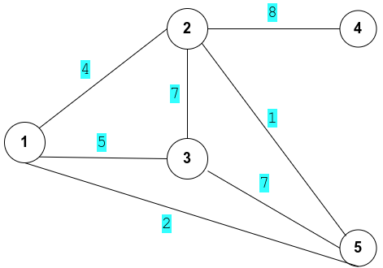

# K shortest path
A program for searching k shortest path

# New data type
1. graph
    -   Input data require:
        -   ```cpp 
            long int number_of_row 
            ```
            number of row in the matrix.
        -   ```cpp 
            vector<vector<long int>> input_matrix 
            ```
            input matrix that contain edges and weight.
        -   *Example:* 
            ```
            7
            1 2 4
            2 3 7
            1 3 5
            2 4 8
            3 5 7
            1 5 2
            2 5 1
            ```
            Explain: a matrix with 4 rows (or a graph with 4 edges)
          
            
          

    -   ```cpp
        graph(vector<vector<long int>> input_matrix, long int number_of_row); 
        ```
        Make a graph out of input matrix.

    -   ```cpp
        long int dist(long int a, long int b);
        ```
        Return distance between node a and b.
    -   ```cpp
        void print();
        ```
        Print graph to terminal (matrix form).

    -   ```cpp
        void delete_edge(long int node_1, long int node_2);
        ```
        Delete edge between 2 nodes.

    -   ```cpp
        void clear();
        ```
        Delete the graph.

2. path
    - Input data:
      ```cpp
      path();
      path(vector<long int> nodeVector);
      ```
      Vector of node or no argument to make empty path.

    -   ```cpp
        long int node(long int nodeIndex);
        ```
        return node according to the input index.

    -   ```cpp
        void erase_node(long int node_1);
        ```
        erase input node.

    -   ```cpp
        void erase_node_pos(long int nodeIndex);
        ```
        erase node according to input index.

    -   ```cpp
        long int size();
        ```
        return size of the path.

    -   ```cpp
        long int pop_node();
        ```
        delete last node and return it.

    -   ```cpp
        void add_node(long int node_1);
        ```
        add input node.

    -   ```cpp
        void add_node(long int node_1, long int pos);
        ```
        add input node to the input position.

    -   ```cpp
        void print();
        ```
        print the path out.

    -   ```cpp
        void clear();
        ```
        clear the path.

    -   ```cpp
        long int find_node_pos(long int node_1);
        ```
        find input node position.
# How to use
Updating..
